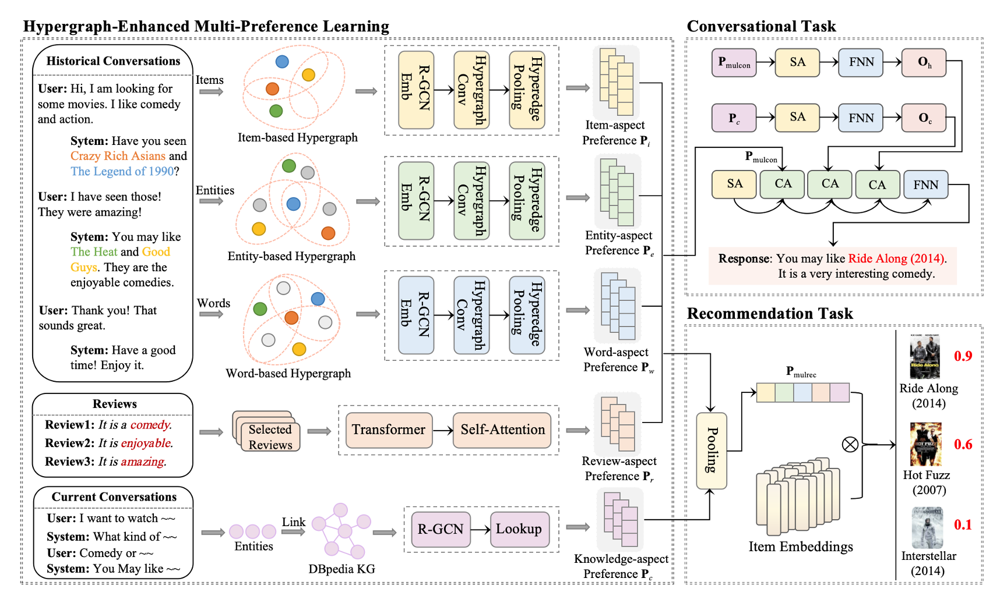

# HyCoRec

The implementation of HyCoRec: Hypergraph-Enhanced Multi-Preference Learning for Alleviating Matthew Effect in Conversational Recommendation (ACL 2024).



Our paper can be viewed at [here](https://aclanthology.org/2024.acl-long.138/)

## Python venv

We use `uv` to manage HyCoRec's python venv. You can click this [url](https://docs.astral.sh/uv/) for more details about `uv`.

```bash
uv venv --python 3.12
```

## Dataset

The dataset will be automatically download after you run the repo's code. However, the item/entity/word edger should be built by followed command:

```bash
cd HyCoRec/
uv run run_edger.py -d redial
```

Or download the whole dataset and item/entity/word edger from [here](https://drive.tokisakix.cn/share/EAOsjDMF)

Place the dataset in path `HyCoRec/data`.

## How to run

Run the crslab framework by followed command:

```bash
cd HyCoRec/
uv run run_crslab.py -c config/crs/hycorec/redial.yaml -g 0 -s 3407
```